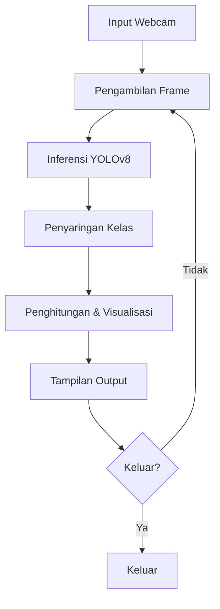

# 📝 README untuk Sistem Deteksi Orang & Elektronik Real-Time

## 📌 Gambaran Umum
Proyek ini mengimplementasikan sistem deteksi objek real-time menggunakan YOLOv8 untuk mengidentifikasi **orang dan perangkat elektronik** (ponsel, laptop, TV, keyboard, mouse) dari umpan webcam. Sistem ini menyediakan:
- Deteksi real-time dengan kotak pembatas
- Penghitungan objek per kategori
- Metrik kinerja (penghitung FPS)
- Pelacakan riwayat deteksi

## 🚀 Fitur
- **Deteksi Tertarget**: Fokus pada 6 kelas objek spesifik
- **Dashboard Kinerja**: Menampilkan FPS real-time dan jumlah objek
- **Pelacakan Riwayat**: Menyimpan riwayat deteksi 5 menit
- **Resolusi Tinggi**: Memproses video dengan resolusi 1280x720
- **Inferensi Dioptimalkan**: Menggunakan threshold kepercayaan untuk akurasi lebih baik

## ⚙️ Instalasi
1. Clone repositori:
   ```bash
   git clone https://github.com/dhmsAdhty/comvis.git
   cd comvis
   ```

2. Instal dependensi:
   ```bash
   pip install -r requirements.txt
   ```
   *(atau instal manual: `pip install ultralytics opencv-python`)*

3. Unduh model YOLOv8n (akan terunduh otomatis saat pertama kali dijalankan jika belum ada)

## 🖥️ Penggunaan
Jalankan sistem deteksi:
```bash
python deteksi2.py
```

**Kontrol:**
- Tekan `Q` untuk keluar dari aplikasi
- Lihat statistik real-time di overlay dashboard

## 🎯 Kelas Target
| ID Kelas | Objek    | Warna Tampilan |
|----------|----------|----------------|
| 0        | Orang    | Hijau          |
| 67       | Ponsel   | Merah          |
| 63       | Laptop   | Biru           |
| 62       | TV       | Kuning         |
| 66       | Keyboard | Cyan           |
| 64       | Mouse    | Magenta        |

## 🛠️ Kustomisasi
Untuk memodifikasi deteksi:
1. Ubah kelas target dalam kamus `target_classes`
2. Sesuaikan threshold kepercayaan di `model.predict(conf=0.6)`
3. Modifikasi resolusi di pemanggilan `cap.set()`

## 🤝 Kontribusi
Pull request diterima! Untuk perubahan besar, silakan buka issue terlebih dahulu.

## 📜 Lisensi
[MIT](LICENSE)

---


