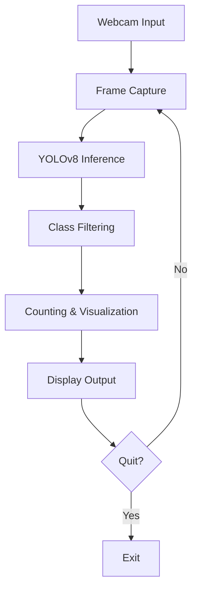

# 📝 README for Real-Time Person & Electronics Detection System

## 📌 Overview
This project implements a real-time object detection system using YOLOv8 to identify **people and electronic devices** (phones, laptops, TVs, keyboards, mice) from webcam feed. The system provides:
- Real-time detection with bounding boxes
- Object counting per category
- Performance metrics (FPS counter)
- Detection history tracking

 *(Example detection output)*

## 🚀 Features
- **Targeted Detection**: Focuses on 6 specific object classes
- **Performance Dashboard**: Shows real-time FPS and object counts
- **History Tracking**: Maintains 5-minute detection history
- **High Resolution**: Processes video at 1280x720 resolution
- **Optimized Inference**: Uses confidence thresholding for better accuracy

## ⚙️ Installation
1. Clone the repository:
   ```bash
   git clone https://github.com/dhmsAdhty/comvis.git
   cd comvis
   ```

2. Install dependencies:
   ```bash
   pip install -r requirements.txt
   ```
   *(or manually install: `pip install ultralytics opencv-python`)*

3. Download YOLOv8n model (will auto-download on first run if not present)

## 🖥️ Usage
Run the detection system:
```bash
python detect.py
```

**Controls:**
- Press `Q` to quit the application
- See real-time stats in the dashboard overlay

## 🎯 Target Classes
| Class ID | Object   | Display Color |
|----------|----------|---------------|
| 0        | Person   | Green         |
| 67       | Phone    | Red           |
| 63       | Laptop   | Blue          |
| 62       | TV       | Yellow        |
| 66       | Keyboard | Cyan          |
| 64       | Mouse    | Magenta       |

## 🛠️ Customization
To modify the detection:
1. Change target classes in `target_classes` dictionary
2. Adjust confidence threshold in `model.predict(conf=0.6)`
3. Modify resolution in `cap.set()` calls

## 📊 Performance
- Achieves **15-25 FPS** on mid-range CPUs
- Lower resolution increases FPS but reduces detection accuracy

## 🤝 Contributing
Pull requests are welcome! For major changes, please open an issue first.

## 📜 License
[MIT](LICENSE)

---



Let me know if you'd like me to add any additional sections or modify the content!
